# SSM桂电书籍管理系统

#### 介绍
SSM桂电书籍管理系统，使用SSM框架练手的轻量级图书管理系统，项目非常简单，适用于刚入门的新手学习。

#### 软件架构
- **环境依赖**

  Tomcat 8.5.60

  Mysql 8.0.23

  JDK13

- **使用技术**

  SpringMVC

  Mybatis

  JSP

#### 安装教程

**1.首先配置数据库**

自行创建一个数据库，命名为ssmbuild ，编码为utf8_unicode_ci 

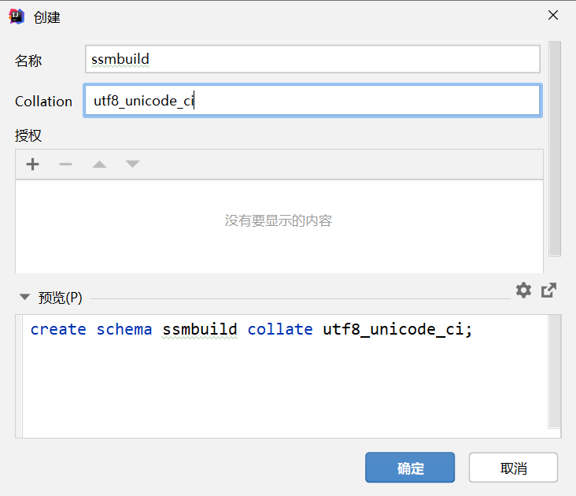

将项目中的ssmbuild-521.sql  数据库备份文件进行恢复

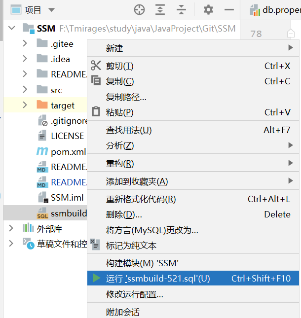

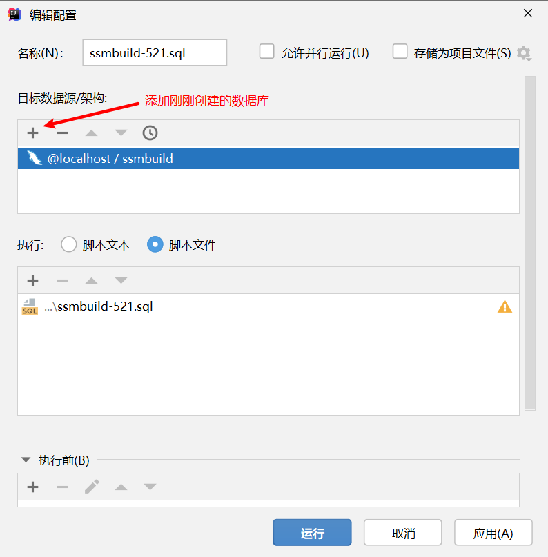

**2.配置Tomcat**

添加一个Tomcat , 点击修正

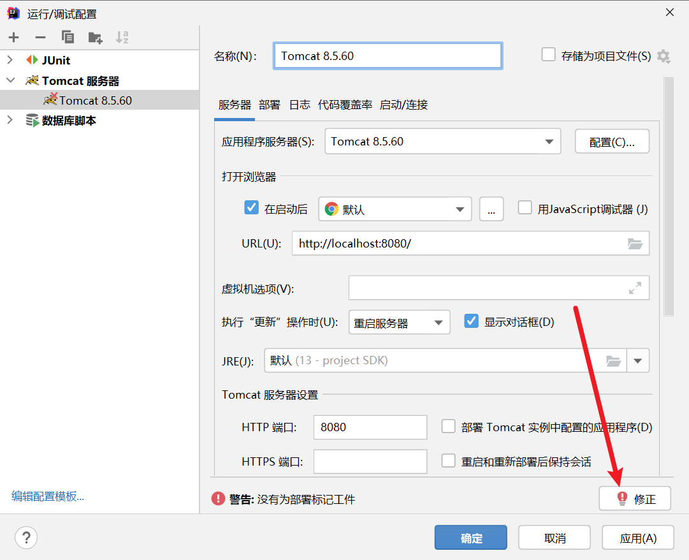

添加即可

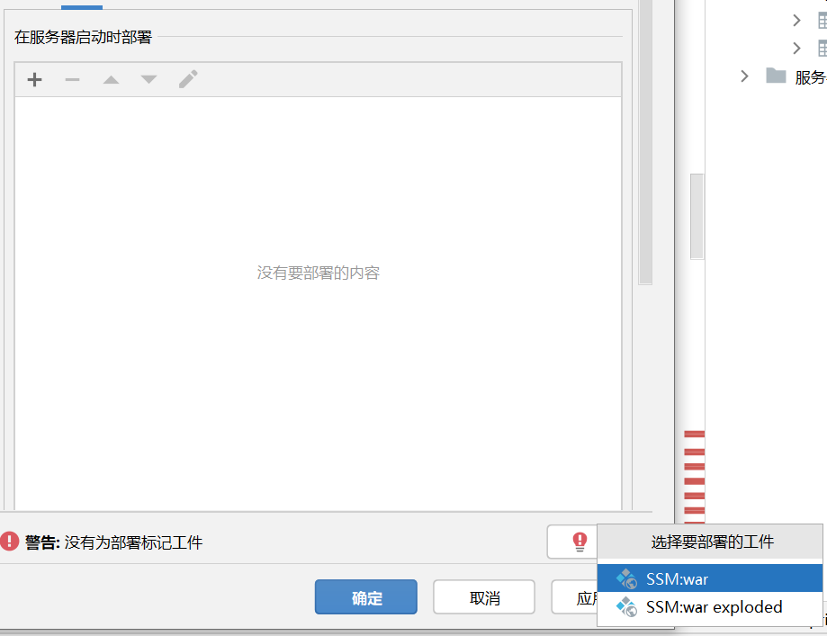

**3.配置maven**

这里改为自己的maven仓库

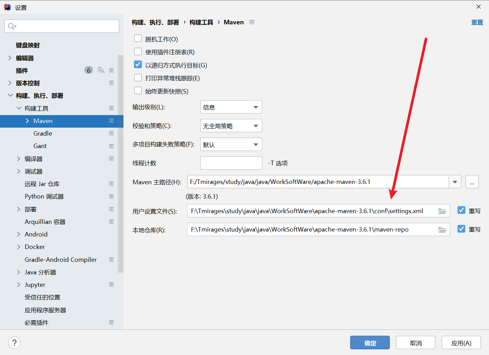

**4.如果目前版本的JDK报错，更改JDK为13**

第一步在这里设置：

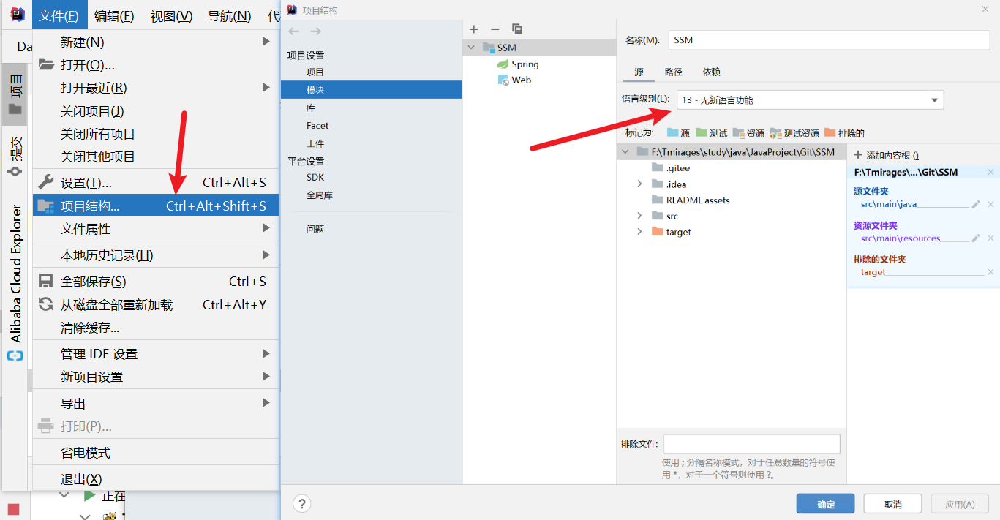

第二步点击上图里的第一个项目选项进行设置 

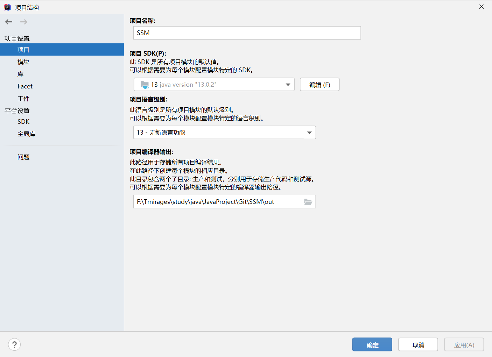

第三步

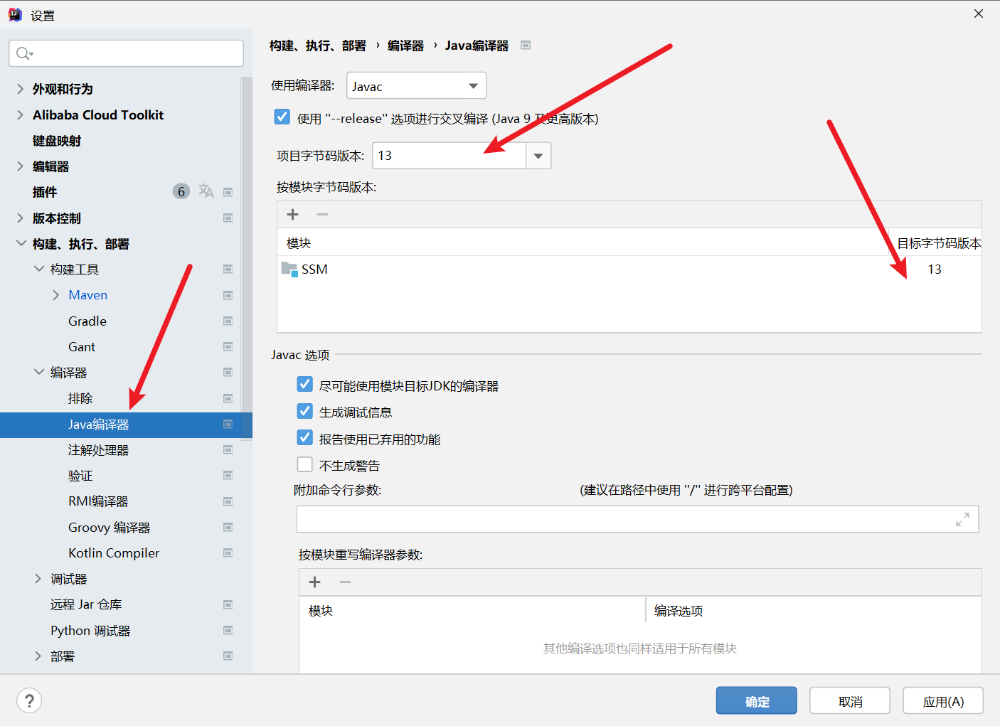

**5.设置完启动Tomcat即可运行，8080端口需要开放**

时代变了 , 不建议学习 SSM框架!!

SSM这种古董级项目可能会出现很多问题! 如果跑不起来 , 试试以下几种方法进一步解决尝试!

#### 1.解决Tomcat与SpringMVC报错问题:

原因是导出的文件没有依赖

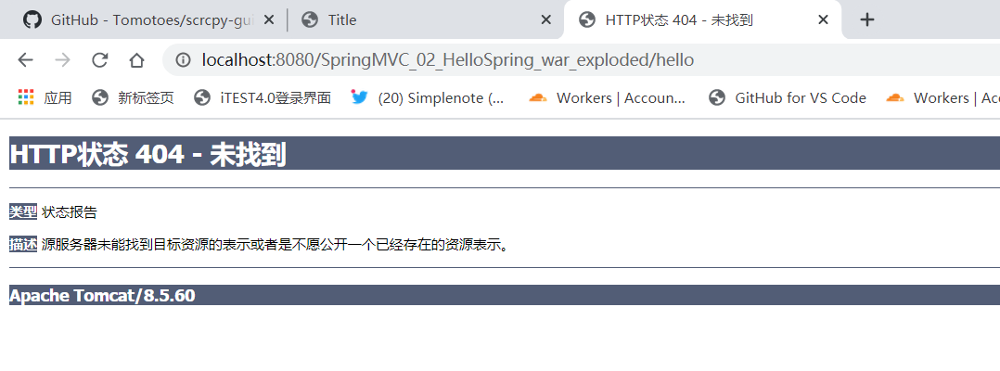

(1).新建lib:

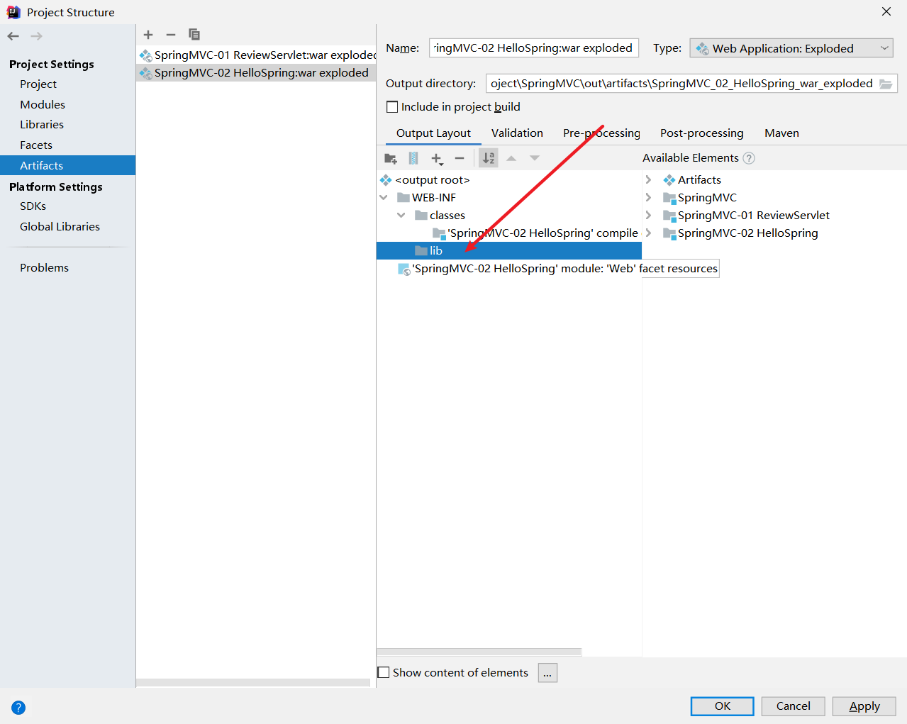

(2).添加Library Files:

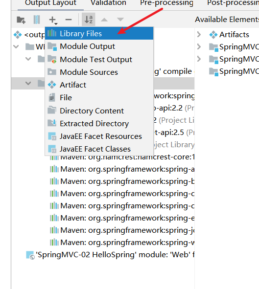

(3).添加即可:

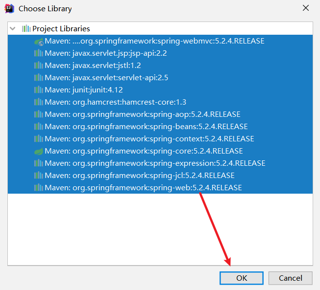

**运行即可解决:**

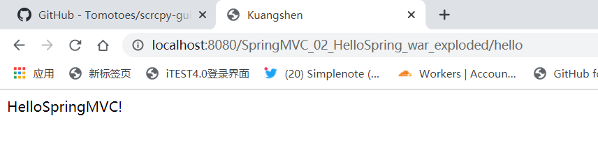

## 

#### 项目截图

- **登录页**

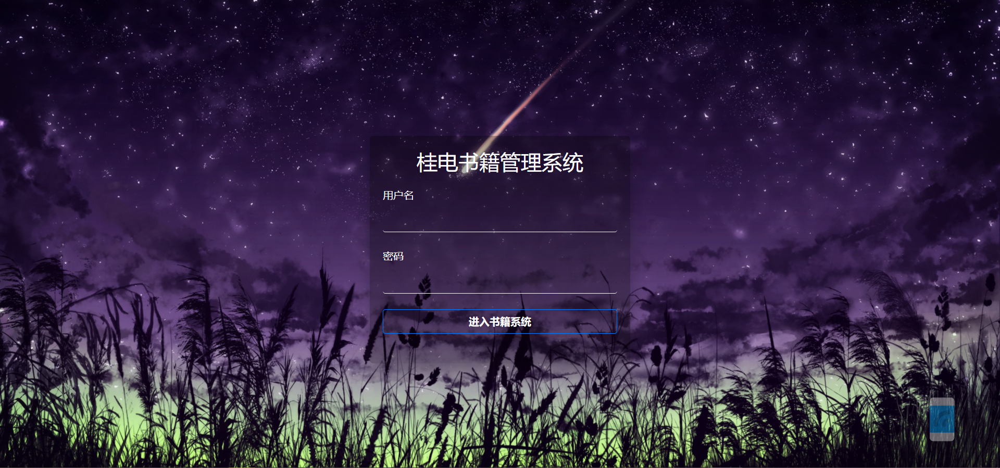

- **主页**

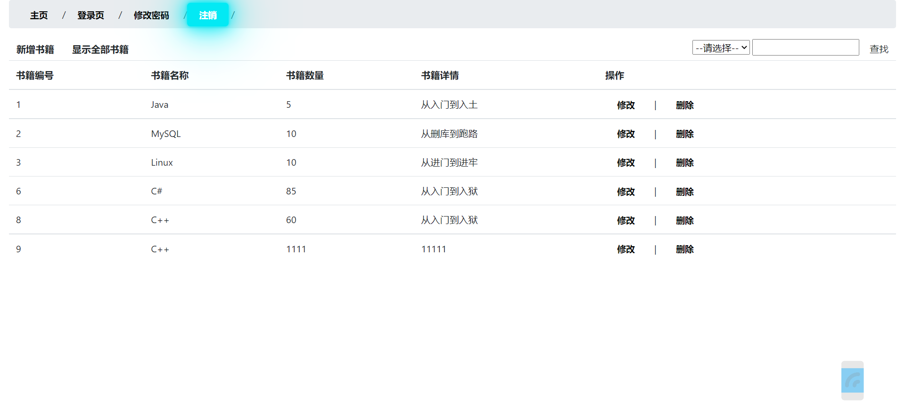

- **增加书籍**

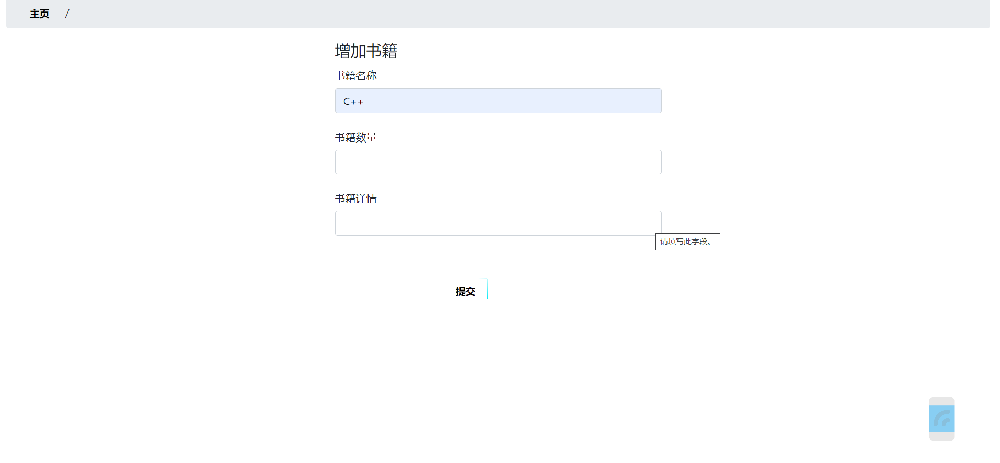

#### 参与贡献

#### 特技

